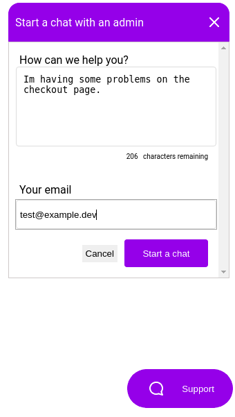
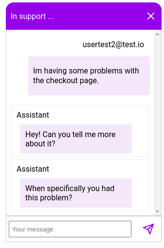
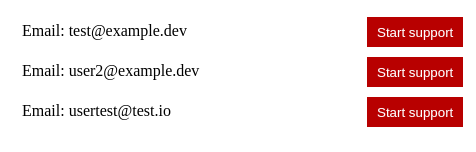
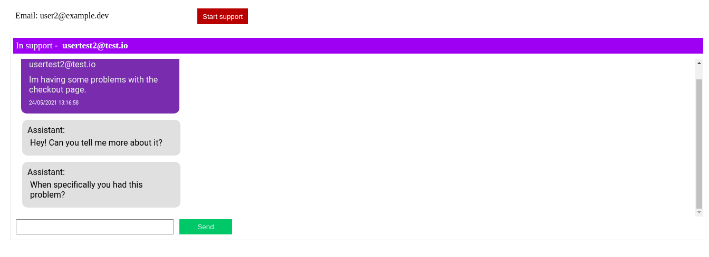

<h1 align="center">Chatty</h1>

	
  

  

  

  

<blockquote align="center">Project made during the NWL#05 Node, an event by <a href="https://rocketseat.com.br/">Rocketseat</a> with the instructor <a href="https://github.com/danileao">Daniele Leão</a>.</blockquote>
 

<h2 align="center">Table of Content</h2>

<a href="#rocket-features">Features</a>
·
<a href="#gear-technologies">Technologies</a>
·
<a href="#eyes-preview">Preview</a>
·
<a href="#question-how-to-test">How to test</a>
·
<a href="#copyright-license">License</a>

# :rocket: Features

- Send and receive messages as an admin or user

### User

- Start a chat with an admin

### Admin

- See all open chat requests from users

- Reply all open chat requests

# :gear: Technologies

### Main technologies used

- [Node.JS](https://github.com/nodejs/node)
- [Express](https://github.com/expressjs/express)
- [Typescript](https://github.com/microsoft/TypeScript)
- [Socket.io](https://github.com/socketio/socket.io)
- [TypeORM](https://github.com/typeorm/typeorm)

<!-- # :bookmark_tabs: Documentation -->

# :eyes: Preview

Click to expand screenshots section

# :question: How to test

### Wanna run the application?

1. Clone the repository and install the dependencies with `yarn install`

2. Create a `database.sqlite` file in the database folder

3. Run the migrations with `yarn typeorm migrations:run`

4. Start the server with `yarn dev`

# :copyright: License

This project is under the [MIT license](./LICENSE).

Made with ❤︎ by <a href="https://github.com/vitorquadros">Vitor Quadros</a>

